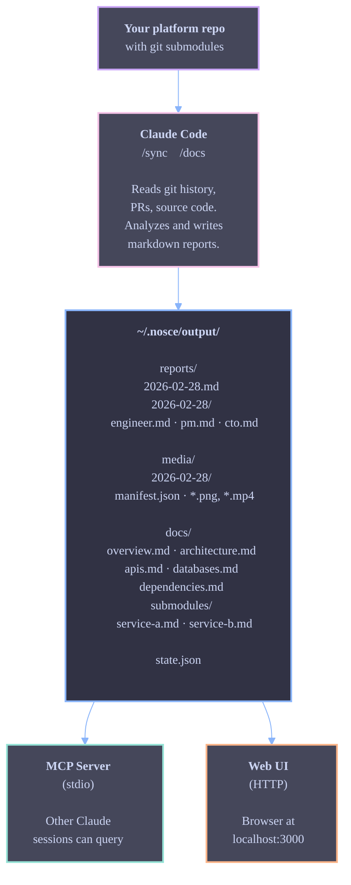

# nosce

**Automated daily changelogs and architecture docs for multi-repo platforms, powered by Claude.**

If your platform is split across many git submodules, keeping track of what changed — and what it means — is hard. Engineers miss breaking changes from other teams. Product managers piece together delivery status from Slack threads. Sales has no idea what shipped last week.

Nosce fixes this. You point it at a repository that contains git submodules, and Claude analyzes every one of them: commits, merged PRs, code structure, database schemas, API contracts. It produces:

- **Daily reports** — not just commit lists, but grouped-by-theme summaries that explain _what changed and why it matters_, with embedded screenshots and videos from PRs.
- **Role-specific summaries** — the same changes, rewritten for engineers (breaking changes, deployment risks), product managers (feature progress, blockers), and sales (customer-facing improvements, demo-worthy features).
- **Architecture documentation** — service topology diagrams, API contracts, database schemas, and dependency graphs, kept up to date automatically.

Results are served through a **web UI** for humans and an **MCP server** for other Claude sessions — so you can ask "what changed in auth-service yesterday?" from any project.

## Table of Contents

- [Prerequisites](#prerequisites)
- [Installation](#installation)
- [Quick Start](#quick-start)
- [How It Works](#how-it-works)
- [Configuration](#configuration)
- [Generating Reports](#generating-reports)
- [Generating Documentation](#generating-documentation)
- [Browsing Results](#browsing-results)
- [MCP Server](#mcp-server)
- [Web UI](#web-ui)
- [Project Structure](#project-structure)
- [Building from Source](#building-from-source)
- [Troubleshooting](#troubleshooting)

## Prerequisites

| Tool              | What for                            | Install                                |
| ----------------- | ----------------------------------- | -------------------------------------- |
| **Claude Code**   | Runs the `/sync` and `/docs` skills | See below                              |
| **Git**           | Submodule operations                | Already on your machine                |
| **gh** (optional) | Fetches merged PR data from GitHub  | `brew install gh` then `gh auth login` |

If you're [building from source](#building-from-source), you also need **Rust** (`curl --proto '=https' --tlsv1.2 -sSf https://sh.rustup.rs | sh`) and **Node.js 18+** (`brew install node` or [nodejs.org](https://nodejs.org)).

### Installing Claude Code

Pick one method:

**Native install (recommended)** — auto-updates in the background:

```bash
curl -fsSL https://claude.ai/install.sh | bash
```

**Homebrew:**

```bash
brew install --cask claude-code
```

Then start it in any project with `claude`. You'll be prompted to log in on first use. See [code.claude.com/docs](https://code.claude.com/docs/en/overview) for other platforms (Windows, VS Code, JetBrains, Desktop app).

## Installation

### Install script (recommended)

The install script downloads the latest pre-built binary for your platform, verifies the checksum, and places it in `~/.local/bin`:

```bash
curl -fsSL https://raw.githubusercontent.com/julienandreu/nosce/main/install.sh | sh
```

Make sure `~/.local/bin` is in your `PATH`. If it isn't, add this to your shell profile (`~/.zshrc`, `~/.bashrc`, etc.):

```bash
export PATH="$HOME/.local/bin:$PATH"
```

To install to a different directory:

```bash
NOSCE_INSTALL_DIR=/usr/local/bin curl -fsSL https://raw.githubusercontent.com/julienandreu/nosce/main/install.sh | sh
```

### GitHub Releases

Download a pre-built binary directly from the [releases page](https://github.com/julienandreu/nosce/releases/latest). Binaries are available for:

| Platform             | Target                          |
| -------------------- | ------------------------------- |
| macOS (Apple Silicon) | `aarch64-apple-darwin`         |
| macOS (Intel)         | `x86_64-apple-darwin`          |
| Linux (x86_64)        | `x86_64-unknown-linux-musl`    |
| Linux (aarch64)       | `aarch64-unknown-linux-gnu`    |

Download the `.tar.gz` for your platform, then:

```bash
tar xzf nosce-*.tar.gz
sudo mv nosce /usr/local/bin/
```

### Docker

Build and run from the included Dockerfile:

```bash
docker build -t nosce .
docker run -v ~/.nosce/output:/data -p 3000:3000 nosce serve
```

The container exposes port 3000 and persists data to `/data`. Mount your output directory to keep reports across restarts.

### Build from source

If you prefer to build from source, see [Building from Source](#building-from-source).

## Quick Start

This gets you from zero to a generated report in 5 minutes.

```bash
# 1. Install nosce
curl -fsSL https://raw.githubusercontent.com/julienandreu/nosce/main/install.sh | sh

# 2. Create the output directory
mkdir -p ~/.nosce/output

# 3. Clone the repo (needed for Claude Code skills)
git clone https://github.com/julienandreu/nosce.git
cd nosce

# 4. Open Claude Code in this repo
claude
```

Once inside Claude Code, run:

```
/sync /path/to/your/platform-repo
```

Replace `/path/to/your/platform-repo` with the path to a git repository that has submodules.

That's it. Claude will analyze every submodule and generate a base report at `~/.nosce/output/reports/YYYY-MM-DD.md`, plus profile-specific summaries in `~/.nosce/output/reports/YYYY-MM-DD/` for each configured profile (engineer, product, sales).

To generate architecture documentation:

```
/docs /path/to/your/platform-repo
```

To browse everything in a web UI:

```bash
nosce --output-dir ~/.nosce/output serve
```

Open http://localhost:3000.

## How It Works



**The key insight**: Claude is the analytical engine. The `/sync` and `/docs` skills tell Claude what to look at, and Claude writes the reports and documentation. It doesn't just list commits — it groups them by theme, identifies breaking changes, explains what changed and why it matters, draws architecture diagrams in Mermaid, and maps service dependencies.

## Configuration

Edit `nosce.config.yml` in the repo root:

```yaml
version: 1

# Path to the repository containing submodules (can also be passed as CLI arg)
input: /Users/you/github/your-platform

# Where nosce writes reports and docs
output: ~/.nosce/output

# Your GitHub username or org (used by gh CLI for PR lookups)
github_owner: your-org

# Report settings
reports:
  timezone: Europe/Paris

# Which doc categories to generate
docs:
  categories:
    - overview
    - architecture
    - apis
    - databases
    - dependencies

# User profiles — each profile sees a tailored report summary
profiles:
  - id: engineer
    label: Engineer
    icon: wrench
    description: "Technical implementation: code changes, diffs, breaking changes, architecture, testing, deployment risks"
    focus:
      [
        commit_details,
        code_diffs,
        breaking_changes,
        tech_debt,
        architectural_impact,
        test_coverage_impact,
        regression_potential,
        deployment_safety,
      ]
  - id: product
    label: Product
    icon: lightbulb
    description: "Delivery orchestration: feature progress, dependencies, velocity, risk assessment, roadmap alignment"
    focus:
      [
        feature_progress,
        delivery_status,
        blockers,
        cross_team_dependencies,
        risk_assessment,
        sprint_health,
        roadmap_alignment,
        feature_completeness,
      ]
  - id: sales
    label: Sales
    icon: megaphone
    description: "Customer-facing changes: new features, bug fixes, competitive advantages, answers for sales leads"
    focus:
      [
        new_features,
        customer_benefits,
        competitive_advantages,
        release_highlights,
        user_facing_bugs,
        ux_improvements,
        demo_worthy_changes,
      ]
```

You can skip editing this file entirely and pass paths as arguments:

```
/sync /path/to/repo --output /path/to/output
```

## Generating Reports

### The `/sync` skill

```
/sync [input-path] [--output path] [--date YYYY-MM-DD]
```

**What it does:**

1. Reads `.gitmodules` from your platform repo to find all submodules
2. For each submodule, fetches new commits since the last sync
3. Queries GitHub for merged PRs (if `gh` is authenticated)
4. Extracts and downloads screenshots/videos from PR descriptions
5. Claude analyzes all changes and generates a markdown report with embedded media

**Example:**

```
/sync ~/github/my-platform
```

**What you get** — a file at `~/.nosce/output/reports/2026-02-28.md`:

```markdown
# Nosce Daily Report — 2026-02-28

> Generated at 2026-02-28T08:00:00Z by Claude

## Summary

- **4** submodules analyzed
- **23** new commits across all submodules
- **7** PRs merged
- Key highlights: New authentication flow deployed in auth-service,
  database migration adds user preferences table in user-service.

---

## auth-service

**Branch**: `main` | **Repo**: `github.com/myorg/auth-service`

### Changes Overview

Major rework of the authentication flow. The team replaced the
session-based auth with JWT tokens (commits by @alice and @bob).
PR #142 introduced the token refresh endpoint. This is a breaking
change for clients that relied on cookie-based sessions.

### Commits (8 new)

| SHA       | Author | Message                      | Date       |
| --------- | ------ | ---------------------------- | ---------- |
| `a1b2c3d` | Alice  | feat: JWT token generation   | 2026-02-28 |
| `e4f5g6h` | Bob    | feat: token refresh endpoint | 2026-02-28 |

| ...

### Merged PRs (3)

- **#142** — JWT authentication (@alice, merged 2026-02-28) — +340 -120
- **#141** — Remove session middleware (@bob, merged 2026-02-27) — +12 -89

### Impact Assessment

- **Risk level**: High
- **Areas affected**: Authentication, API middleware, client SDKs
- **Action items**: Update all API clients to use Bearer tokens

### Screenshots & Videos

|                                                                     |                                                                                                                      |
| ------------------------------------------------------------------- | -------------------------------------------------------------------------------------------------------------------- |
|  | [**#142**](https://github.com/myorg/auth-service/pull/142) — JWT authentication ([@alice](https://github.com/alice)) |

---

## No Changes

- config-service (already up to date)
```

All references in reports are clickable: PR numbers link to GitHub PRs, commit SHAs link to the commit page, `@author` mentions link to GitHub profiles, and repo names link to the repository. External links open in a new tab.

### Profile-specific summaries

After generating the base report, `/sync` creates a tailored summary for each profile defined in `nosce.config.yml`. Each summary re-analyzes the same changes through the lens of a specific role:

| Profile      | What they see                                                                                          |
| ------------ | ------------------------------------------------------------------------------------------------------ |
| **Engineer** | Code changes, diffs, breaking changes, architectural impact, test coverage, deployment risks           |
| **Product**  | Feature progress, delivery status, blockers, cross-team dependencies, sprint health, roadmap alignment |
| **Sales**    | New customer-facing features, bug fixes, competitive advantages, demo-worthy changes, UX improvements  |

The summaries are stored alongside the base report:

```
~/.nosce/output/reports/
  2026-02-28.md          # Full base report
  2026-02-28/            # Profile summaries
    engineer.md
    product.md
    sales.md
```

### Running it again

The second time you run `/sync`, it only picks up changes since the last run. The state is tracked in `~/.nosce/output/state.json`.

To force a specific date: `/sync ~/github/my-platform --date 2026-02-27`

## Generating Documentation

### The `/docs` skill

```
/docs [input-path] [--output path] [--full] [submodule-name]
```

**What it does:**

1. Reads `.gitmodules` to find submodules
2. For each submodule, scans key files: README, Dockerfiles, API specs (proto, OpenAPI), database schemas (migrations, Prisma), entry points, dependency files
3. Claude synthesizes comprehensive architecture documentation

**Example:**

```
/docs ~/github/my-platform
```

**What you get** — files in `~/.nosce/output/docs/`:

| File                         | Contents                                                                |
| ---------------------------- | ----------------------------------------------------------------------- |
| `overview.md`                | What the platform does, each service's role, how they relate            |
| `architecture.md`            | Mermaid diagrams of service topology, sequence diagrams for key flows   |
| `apis.md`                    | All API endpoints across services, request/response shapes              |
| `databases.md`               | Every database, key tables, ownership, relationships                    |
| `dependencies.md`            | Mermaid graph of who calls whom, shared libraries, external deps        |
| `submodules/auth-service.md` | Deep dive into auth-service: purpose, stack, architecture, APIs, config |
| `submodules/user-service.md` | Deep dive into user-service                                             |
| ...                          | One file per submodule                                                  |

### Updating docs

Run `/docs` again — it only re-analyzes submodules that changed since the last run. To force a full regeneration: `/docs ~/github/my-platform --full`

To analyze a single submodule: `/docs ~/github/my-platform auth-service`

### Package-level documentation

For submodules that are monorepos (containing multiple packages), `/docs` generates per-package docs within the submodule directory. These are browsable in the web UI under each submodule.

### Manual annotations

Add notes that Claude will preserve across regenerations:

```markdown
## Architecture

(Claude's auto-generated content)

<!-- manual -->

> Note: The WebSocket feature is experimental. Do not expose in production.

<!-- /manual -->
```

Anything between `<!-- manual -->` and `<!-- /manual -->` will never be overwritten.

## Browsing Results

You have three ways to access generated content.

### 1. Read the files directly

They're just markdown files:

```bash
cat ~/.nosce/output/reports/2026-02-28.md
ls ~/.nosce/output/docs/
```

### 2. Web UI

Start the web server:

```bash
nosce --output-dir ~/.nosce/output serve
```

Open http://localhost:3000. You get:

- **Per-request spinner feedback** in the terminal — each API request shows a braille-dot spinner that resolves to a green checkmark on success or a red cross on failure, with elapsed time
- **Profile selector** at the top of the sidebar — switch between Engineer, Product, and Sales to see role-specific report summaries
- Sidebar navigation with all reports, doc categories, and submodules
- Full-text search across everything
- Markdown rendered to HTML with syntax highlighting
- **Screenshots & videos gallery** — collapsible panel with PR screenshots, grouped by repo/PR, with a lightbox viewer
- **Command palette** — press `Cmd+K` (or `Ctrl+K`) to search across everything without leaving the current page
- **Table of contents** — sticky sidebar TOC with active heading tracking on docs and report pages
- **Interactive Mermaid diagrams** — pan, zoom, and double-click to reset; theme switches with light/dark mode
- **Clickable references** — PR numbers, commit SHAs, repo names, and author mentions are markdown links pointing to GitHub
- **External links open in new tabs** — all `http/https` links get `target="_blank"` automatically
- Catppuccin color theme (Mocha dark / Latte light, matches your OS preference)

Your selected profile is saved in the browser and persists across sessions.

Options:

```bash
# Custom port
nosce --output-dir ~/.nosce/output serve --port 8080

# Bind to all interfaces (not just localhost)
nosce --output-dir ~/.nosce/output serve --host 0.0.0.0

# Run as a background daemon
nosce --output-dir ~/.nosce/output serve -d

# Stop a running daemon
nosce stop
```

### 3. MCP Server

The MCP server lets other Claude sessions query your generated docs and reports. This is the most powerful option — you can ask Claude natural language questions and it retrieves the relevant documentation.

See [MCP Server](#mcp-server) below for setup.

## MCP Server

### Setup

Add nosce to your Claude Code MCP configuration. You can do this per-project or globally.

**Per-project** — create `.mcp.json` in any project:

```json
{
  "mcpServers": {
    "nosce": {
      "type": "stdio",
      "command": "/absolute/path/to/nosce/target/release/nosce",
      "args": ["--output-dir", "~/.nosce/output"]
    }
  }
}
```

**Or via CLI:**

```bash
claude mcp add --scope user --transport stdio nosce \
  /absolute/path/to/nosce/target/release/nosce \
  -- --output-dir ~/.nosce/output
```

If nosce is already in your `PATH` and you've set `NOSCE_OUTPUT_DIR` (e.g. via `nosce init`):

```bash
claude mcp add --scope user --transport stdio nosce \
  $(which nosce) \
  -- --output-dir $(NOSCE_OUTPUT_DIR)
```

### Available tools

Once configured, Claude has access to these tools in any session:

| Tool                | What it does                                                                                   |
| ------------------- | ---------------------------------------------------------------------------------------------- |
| `get_daily_report`  | Get a report by date, or the latest one. Optionally pass a `profile` for a role-specific view. |
| `list_reports`      | List all available report dates                                                                |
| `list_profiles`     | List all configured profiles with their descriptions and focus areas                           |
| `get_doc`           | Get a doc by category (overview, architecture, apis, databases, dependencies)                  |
| `get_submodule_doc` | Get detailed docs for a specific submodule                                                     |
| `search_docs`       | Full-text search across all reports and docs                                                   |
| `get_changelog`     | Get a submodule's changes across a date range                                                  |

### Example prompts

With the MCP server running, you can ask Claude in any project:

- "What changed in auth-service yesterday?"
- "Show me the database schema for user-service"
- "What's the overall architecture of our platform?"
- "Search the docs for anything related to WebSocket"
- "Give me the changelog for payment-service from last week"

## Web UI

### Development

To work on the web UI:

```bash
# Terminal 1: Start the Rust web server (serves the API)
cd cli
cargo run -- --output-dir ~/.nosce/output serve

# Terminal 2: Start Vite dev server (hot reload)
cd webui
npm install
npm run dev
```

Vite proxies `/api/*` requests to the Rust server on port 3000. Open http://localhost:5173.

### Production build

```bash
cd webui
npm run build        # Outputs to cli/static/
cd ..
cargo build --release  # Embeds the web UI into the binary
```

The web UI is embedded into the `nosce` binary at compile time using `rust-embed`. After any web UI change, you must re-run `cargo build` for the new assets to take effect. This makes the binary fully self-contained — no external `static/` directory is needed at runtime.

### Tech stack

- **Preact** + **TypeScript** (strict mode)
- **Tailwind CSS** with **Catppuccin** color palette
- **Vite** for builds
- ESLint (strict + stylistic type-checked) + Prettier

## Project Structure

```
nosce/
├── .claude/
│   └── skills/
│       ├── sync/SKILL.md         # /sync — daily changelog generation
│       └── docs/SKILL.md         # /docs — architecture documentation
├── .mcp.json                      # MCP server config (for this repo)
├── nosce.config.yml               # Default configuration
│
├── cli/                           # Rust: CLI + MCP server + web server
│   ├── Cargo.toml
│   └── src/
│       ├── main.rs               # CLI (clap): mcp | serve | stop subcommands
│       ├── config.rs             # Profile definitions + nosce.config.yml loader
│       ├── server.rs             # MCP tools + resources (rmcp)
│       ├── web.rs                # HTTP API + embedded static files (axum, rust-embed)
│       └── fs_ops.rs             # Non-blocking filesystem operations
│
├── webui/                         # Preact SPA
│   ├── package.json
│   ├── tsconfig.json             # Strict TypeScript
│   ├── eslint.config.js          # Strict + stylistic ESLint
│   ├── .prettierrc.json
│   ├── vite.config.ts
│   ├── tailwind.config.js        # Catppuccin Latte + Mocha
│   └── src/
│       ├── main.tsx
│       ├── app.tsx               # Router + ProfileProvider
│       ├── types.ts              # API response types + ProfileInfo
│       ├── constants.ts          # Color/icon mappings for tags, repos, docs
│       ├── index.css             # Tailwind + Catppuccin CSS vars
│       ├── context/
│       │   └── ProfileContext.tsx # Profile state (localStorage-backed)
│       ├── components/
│       │   ├── Sidebar.tsx
│       │   ├── ProfileSelector.tsx  # Role selector dropdown
│       │   ├── MarkdownContent.tsx  # Markdown + Mermaid pan-zoom + code copy
│       │   ├── MediaGallery.tsx     # PR screenshots/videos gallery + lightbox
│       │   ├── CommandPalette.tsx   # Cmd+K global search palette
│       │   └── TableOfContents.tsx  # Sticky TOC with active heading tracking
│       └── pages/
│           ├── Home.tsx
│           ├── ReportsList.tsx
│           ├── ReportView.tsx    # Profile-aware report fetching
│           ├── DocView.tsx
│           ├── SubmoduleView.tsx
│           ├── PackageView.tsx   # Per-package docs for monorepo submodules
│           └── Search.tsx
│
├── README.md
└── LICENSE
```

### Output directory structure

After running `/sync` and `/docs`, your output directory looks like:

```
~/.nosce/output/
├── state.json                     # Tracks last-synced SHA per submodule
├── reports/
│   ├── 2026-02-28.md             # Base daily report (full)
│   ├── 2026-02-28/               # Profile-specific summaries
│   │   ├── engineer.md
│   │   ├── product.md
│   │   └── sales.md
│   ├── 2026-02-27.md
│   └── ...
├── media/                         # Screenshots & videos from PRs
│   └── 2026-02-28/
│       ├── manifest.json          # Metadata: filename, repo, PR, author
│       ├── auth-service-pr142-1.png
│       ├── auth-service-pr142-2.png
│       └── ...
└── docs/
    ├── overview.md               # Platform overview
    ├── architecture.md           # Mermaid diagrams, service topology
    ├── apis.md                   # All API contracts
    ├── databases.md              # All database schemas
    ├── dependencies.md           # Service dependency graph
    └── submodules/
        ├── auth-service.md       # Per-submodule deep dive
        ├── user-service.md
        └── ...
```

## Building from Source

### Web UI (build first)

```bash
cd webui
npm install
npm run build       # Production build -> cli/static/
npm run dev         # Dev server with hot reload
npm run typecheck   # TypeScript check
npm run lint        # ESLint
npm run format      # Prettier check
```

### Rust server

The web UI must be built before compiling the Rust binary — `rust-embed` embeds everything in `cli/static/` into the binary at compile time.

```bash
cargo build --release
```

Binary: `target/release/nosce` (self-contained, includes web UI assets)

## Troubleshooting

### "Output directory does not exist"

Create it:

```bash
mkdir -p ~/.nosce/output
```

### `/sync` says "no input path provided"

Either:

- Pass it as an argument: `/sync /path/to/your/repo`
- Or set it in `nosce.config.yml`:
  ```yaml
  input: /path/to/your/repo
  ```

### No PR data in reports

The `/sync` skill uses `gh` CLI to fetch merged PRs. If PRs are missing:

1. Install `gh`: `brew install gh`
2. Authenticate: `gh auth login`
3. Set `github_owner` in `nosce.config.yml`

The skill works fine without `gh` — you just won't see PR info in reports.

### Web UI shows "Frontend not built"

The web UI is embedded into the binary at compile time. Build it and then recompile:

```bash
cd webui
npm install
npm run build
cd ..
cargo build --release
```

Then restart the server.

### Web UI shows "No documentation yet"

Run the skills first to generate content:

```
/sync /path/to/your/repo
/docs /path/to/your/repo
```

### MCP server not connecting

Check that:

1. The binary path in `.mcp.json` is absolute and correct
2. The output directory exists and has content
3. You can run it manually: `nosce --output-dir ~/.nosce/output --help`

### "Your platform repo" — what does that mean?

Nosce expects a git repository that has `.gitmodules` — meaning it contains other git repos as submodules. If you have a monorepo without submodules, nosce isn't the right tool.

To check if a repo has submodules:

```bash
cat /path/to/your/repo/.gitmodules
```

If that file exists and lists submodules, you're good.

## License

MIT — Julien Andreu
